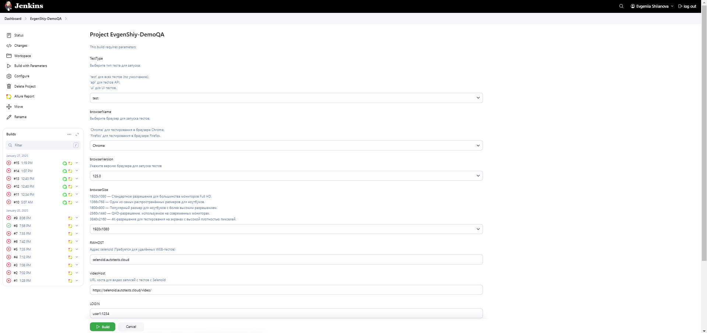
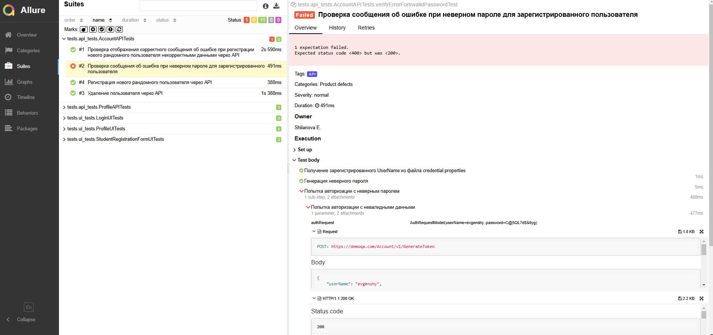
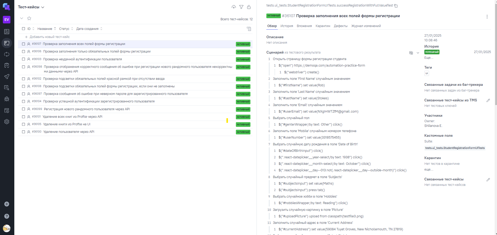
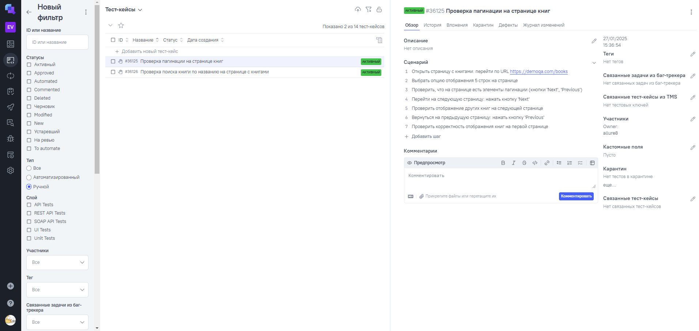
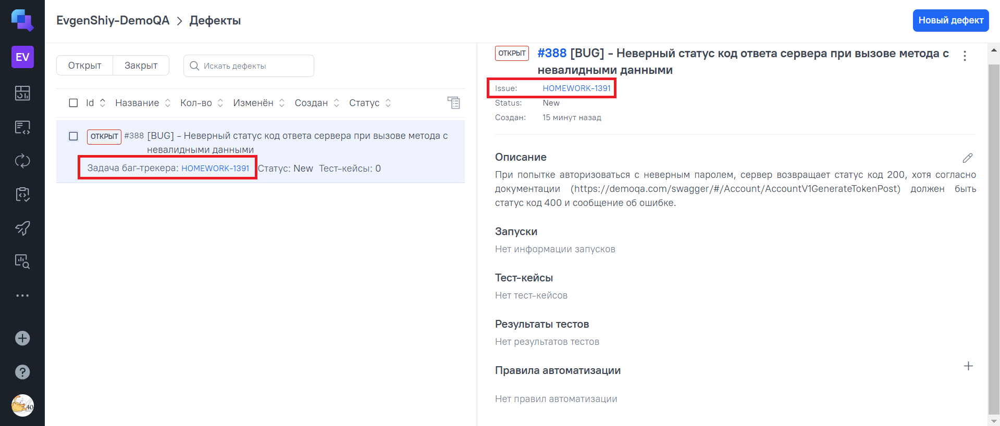
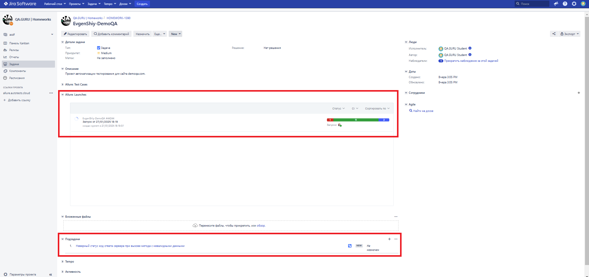

# Проект автоматизации тестирования для [demoqa.com](https://demoqa.com/)  

---


---

## Содержание
* <a href="#о-проекте">О проекте</a>
* <a href="#технологии-и-инструменты">Технологии и инструменты</a>
* <a href="#тест-кейсы">Тест-кейсы</a>
* <a href="#запуски-тестов-из-терминала">Запуски тестов из терминала</a>
* <a href="#интеграции">Интеграции</a>
* <a href="#сборка-в-Jenkins">Сборка в Jenkins</a>
* * <a href="#интеграция-с-Allure-Report">Интеграция с Allure Report</a>
* * <a href="#интеграция-с-Allure-TestOps">Интеграция с Allure TestOps</a>
* * <a href="#интеграция-с-Jira">Интеграция с Jira</a>
* <a href="#уведомление-о-результатах-тестов-в-telegram">Уведомление о результатах тестов в Telegram</a>
* <a href="#видео-прохождения-тестов-в-selenoid">Видео прохождения тестов в Selenoid</a>

---
## <a id="о-проекте"></a>О проекте

Данный проект представляет собой автоматизацию тестирования приложения [demoqa.com](https://demoqa.com/) с использованием Java, Selenide, Rest Assured и других инструментов. Проект охватывает как UI, так и API-тестирование, включая сценарии авторизации, управления корзиной и проверки отображения данных пользователя.

Проект реализован с использованием следующих библиотек и инструментов:
* **[Java](https://www.java.com/)**: основной язык программирования.
* **[Selenide](https://selenide.org/)**: для автоматизации UI-тестов.
* **[Selenoid](https://aerokube.com/selenoid/)**: для запуска тестов в разных браузерах.
* **[Rest Assured](https://rest-assured.io/)**: для выполнения API-тестов.
* **[JUnit 5](https://junit.org/junit5/)**: для написания и выполнения тестов.
* **[Gradle](https://gradle.org/)**: для сборки проекта.
* **[Allure Report](https://github.com/allure-framework/allure2)**: для генерации детализированных отчетов.
* **[Jenkins](https://www.jenkins.io/)**: для организации CI/CD процесса.
* **[Allure TestOps](https://qameta.io/)**: тест-менеджмент система для организации хранения авто- и ручных тестов в едином пространстве, с возможностью кастомизировать запуски.
* **[Jira](https://www.atlassian.com/ru/software/jira)**: для управления задачами.
* **Telegram бот** для уведомления о результатах тестирования.


---

## <a id="технологии-и-инструменты"></a>Технологии и инструменты
<p align="center">
  <a href="https://www.java.com/"></a>
  <a href="https://www.jetbrains.com/idea/"></a>
  <a href="https://github.com/"></a>
  <a href="https://junit.org/junit5/"></a>
  <a href="https://rest-assured.io/"></a>
  <a href="https://gradle.org/"></a>
  <a href="https://selenide.org/"></a>
  <a href="https://aerokube.com/selenoid/"></a>
  <a href="https://qameta.io/"></a>
  <a href="https://github.com/allure-framework"></a>
  <a href="https://www.jenkins.io/"></a>
  <a href="https://www.atlassian.com/software/jira"></a>
  <a href="https://web.telegram.org/"></a>
</p>

---

## <a id="тест-кейсы"></a>Тест-кейсы

<p style="text-align: right;"><a href="#содержание">Перейти к содержанию</a></p>


В проекте реализованы тесты для проверки различных аспектов функциональности приложения [demoqa.com](https://demoqa.com/). Тесты делятся на два типа: автотесты - реализованы для **UI** и **API**, и ручные тесты.
Тесты помогают удостовериться в корректной работе функционала, выявить возможные ошибки и улучшить качество приложения.
Для каждой группы тестов используются отдельные методы и фреймворки, чтобы обеспечить точность и стабильность выполнения.


<details>
  <summary><strong style="color:#2a9d8f;">🌐 UI Тесты</strong></summary>

**UI тесты** проверяют функциональность сайта с точки зрения пользователя. Основное внимание уделяется заполнению форм, аутентификации и отображению информации на сайте.

#### 1. **Login**
1. **Проверка успешной аутентификации** зарегистрированного пользователя.
2. **Проверка неудачной аутентификации** с неверными данными (случайные имя пользователя и пароль).
3. **Проверка подсветки обязательных полей, если они не заполнены**.

#### 2. **BookStore**
1. **Удаление книги из профиля пользователя через UI**.

#### 3. **Student Registration Form**
1. **Проверка заполнения всех полей формы регистрации**.
2. **Проверка заполнения только обязательных полей формы регистрации**.
3. **Проверка подсветки обязательных полей, если они не заполнены**.

</details>

<details>
  <summary><strong style="color:#e76f51;">💻 API Тесты</strong></summary>

**API тесты** обеспечивают проверку функциональности серверной части сайта. Это включает в себя проверку успешной авторизации, взаимодействие с данными пользователей через API и выполнение операций, таких как регистрация, удаление пользователей и обновление данных.

#### 1. **Account**
1. **Регистрации нового пользователя**.
2. **Удаление пользователя**.
3. **Проверка отображения корректного сообщения об ошибке при регистрации нового рандомного пользователя некорректными данными**.
4. **Проверка сообщения об ошибке при неверном пароле для зарегистрированного пользователя**.


#### 2. **BookStore**
1. **Удаления всех книг пользователя**.

</details> 

<details> <summary><strong style="color:#f4a261;">📝 Ручные Тесты</strong></summary>

1. **Проверка пагинации на странице книг**
2. **Проверка поиска книги по названию на странице с книгами**
   
</details>

---

## <a id="запуски-тестов-из-терминала"></a>Запуски тестов из терминала

<p style="text-align: right;"><a href="#содержание">Перейти к содержанию</a></p>

### Тестовые задачи

| Задача | Описание                                                          |
|:-------|:------------------------------------------------------------------|
| `test` | Запускает **все тесты** </br> _(является значением по умолчанию)_ |
| `api`  | Запускает все **api-тесты**                                       |
| `ui`   | Запускает все **ui-тесты**                                        |


### Параметры для запуска тестов

| Параметр                | Описание                                                      | Пример значения          |
|:------------------------|:--------------------------------------------------------------|:-------------------------|
| `${TestType}`           | Тип тестов для выполнения (`test`, `api`, `ui`).              | `test`                   |
| `-Denv`                 | Среда выполнения тестов (`local`, `remote`).                  | `remote`                 |
| `-Drwhost`              | Адрес удаленного сервера, на котором выполняются тесты.       | `https://selenoid.com`   |
| `-Dlogin`               | Логин для авторизации на удаленном сервере.                   | `user`                   |
| `-Dbrowser`             | Браузер, используемый для тестов.                             | `chrome`, `firefox`      |
| `-DbrowserVersion`      | Версия браузера.                                              | `125.0`, `131.0`         |
| `-DbrowserSize`         | Размер окна браузера.                                         | `1920x1080`              |
| `-DvideoHost`           | Хост для доступа к видео прохождения тестов.                  | `https://video.selenoid` |
| `-DprofileUserName`     | Имя пользователя для авторизации в тестируемом приложении.    | `evgensh`                |
| `-DprofileUserPassword` | Пароль пользователя для авторизации в тестируемом приложении. | `Evgensh12*`             |


### Команды для запуска 

#### Локальный запуск:

```bash
gradle clean test
```

#### Удалённый запуск:

```bash
gradle clean test -Denv="remote" -Drwhost="selenoid.autotests.cloud" -Dlogin="user1:1234" -Dbrowser="Chrome" -DbrowserVersion="125.0" -DbrowserSize="1920x1080" -DvideoHost="https://selenoid.autotests.cloud/video/" -DprofileUserName="evgenshy" -DprofileUserPassword="Evgenshy12_!"
```

---

## <a id="интеграции"></a>Интеграции

<p style="text-align: right;"><a href="#содержание">Перейти к содержанию</a></p>

###  <a id="сборка-в-Jenkins"></a>Сборка в [Jenkins](https://jenkins.autotests.cloud/job/EvgenShiy-DemoQA/build?delay=0sec)

Проект интегрирован с Jenkins для автоматизированного запуска тестов. Сборка в Jenkins включает:

- **Параметризованные сборки:**
  Возможность выбора параметров сборки
- **Запуск тестов на удалённом сервере:** Возможность запуска тестов в распределённой инфраструктуре с использованием Selenoid.
- **Автоматическая генерация отчетов:** После завершения сборки формируется отчет в Allure Report, доступный напрямую из Jenkins.

Пример параметризованной сборки в Jenkins:



---

### </a> <a id="интеграция-с-Allure-Report"></a>Интеграция с [Allure Report](https://jenkins.autotests.cloud/job/EvgenShiy-DemoQA/9/allure/)

<p style="text-align: right;"><a href="#содержание">Перейти к содержанию</a></p>

Allure Report — это инструмент для создания подробных и наглядных отчетов о результатах выполнения тестов. В нем отображаются все тестовые шаги, статусы тестов, а также дополнительные детали, такие как время выполнения и возможные ошибки. Allure помогает быстро анализировать результаты тестирования и предоставляет информацию в удобном визуальном формате.

Пример отчета для тестового прогона:


Отчет в Allure включает шаги выполнения тестов, их статус и возможные ошибки, помогая легче отслеживать качество тестируемого приложения.
Шаги выполнения на примере тест-кейса "Проверка заполнения всех полей формы регистрации":

   

---

### </a> <a id="интеграция-с-Allure-TestOps"></a>Интеграция с [Allure TestOps](https://allure.autotests.cloud/project/4585/dashboards)

<p style="text-align: right;"><a href="#содержание">Перейти к содержанию</a></p>

Allure TestOps — это мощная платформа для управления процессами тестирования и анализа результатов. В рамках проекта Allure TestOps используется для:

- Хранения и управления тест-кейсами: Все тест-кейсы проекта (и авто- и ручные) создаются и поддерживаются в Allure TestOps, что упрощает их организацию и обновление.
- Мониторинга результатов тестирования: Интеграция позволяет в реальном времени отслеживать прогресс тестирования, статусы тестов и ключевые метрики.
- Анализа ошибок: Все ошибки и сбои автоматически загружаются в систему, что помогает быстро определить корневые причины и устранить их.
- Планирования тестовых прогонов: Allure TestOps обеспечивает удобный интерфейс для создания и планирования тестовых наборов, что позволяет гибко управлять тестированием в зависимости от задач.

Интеграция с Allure TestOps помогает команде эффективно управлять процессами тестирования, автоматизировать рутинные задачи и улучшать качество продукта.

Пример панели мониторинга в Allure TestOps:

<p align="center">  </p>

Авто-тесты проекта: 

<p align="center">  </p>

Ручные тесты проекта:

<p align="center">  </p>

Дефекты:

<p align="center">  </p>

---

### </a> <a id="интеграция-с-Jira"></a>Интеграция с [Jira](https://jira.autotests.cloud/browse/HOMEWORK-1390)

<p style="text-align: right;"><a href="#содержание">Перейти к содержанию</a></p>

Для повышения прозрачности и управляемости процессами тестирования проект интегрирован с Jira, что позволяет связывать технические результаты с бизнес-задачами, улучшая коммуникацию между командами. 
Кроме того, Jira позволяет эффективно управлять багами, выявленными автотестами, отслеживать их жизненный цикл и фиксировать прогресс исправлений. 
Интеграция автотестов с Jira улучшает качество продукта и прозрачность процессов тестирования.

<p align="center">

</p>

--- 


## </a> <a id="уведомление-о-результатах-тестов-в-telegram"></a>Уведомление о результатах тестов в Telegram

<p style="text-align: right;"><a href="#содержание">Перейти к содержанию</a></p>

После завершения тестов бот Telegram автоматически отправляет уведомления с результатами тестового прогона, включая информацию о количестве пройденных и неудавшихся тестов.

<p align="center">

</p>

---

## </a> <a id="видео-прохождения-тестов-в-selenoid"></a>Видео прохождения тестов в Selenoid

<p style="text-align: right;"><a href="#содержание">Перейти к содержанию</a></p>

Видео прохождения Tест-кейса "Проверка заполнения всех полей формы регистрации":

<p align="center">
   
</p>
