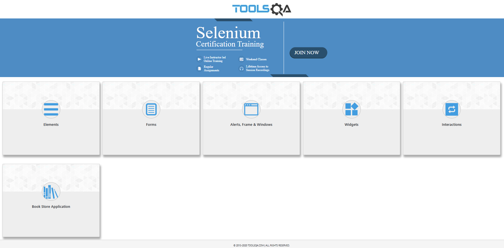
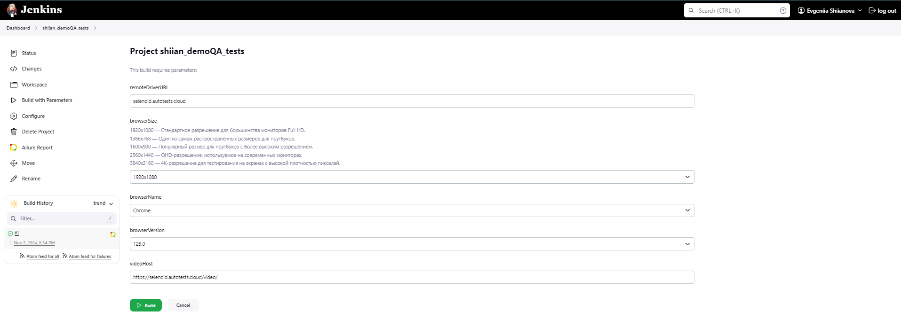
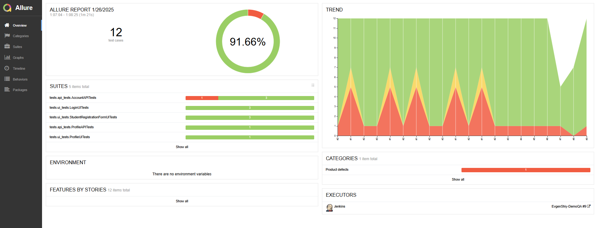
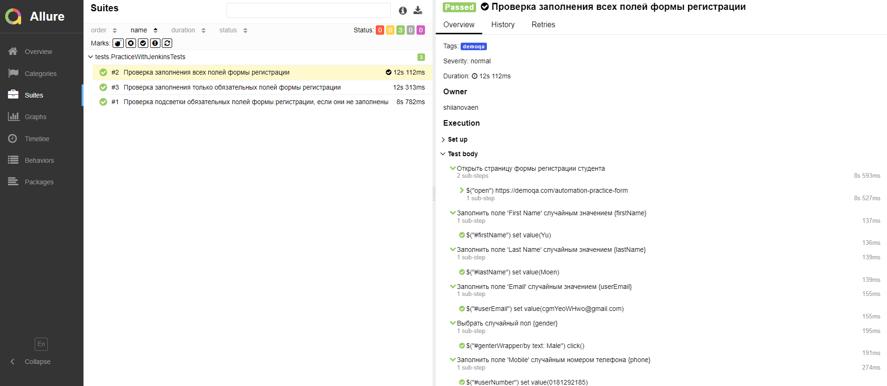
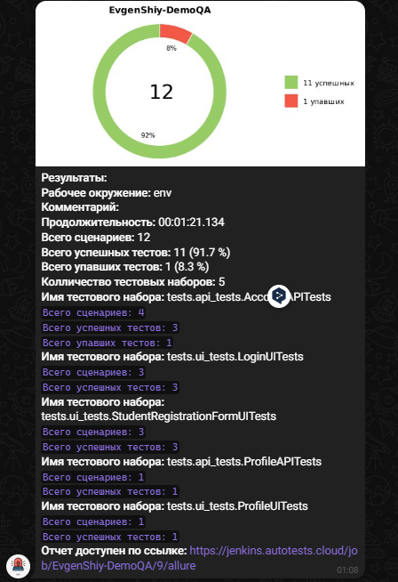
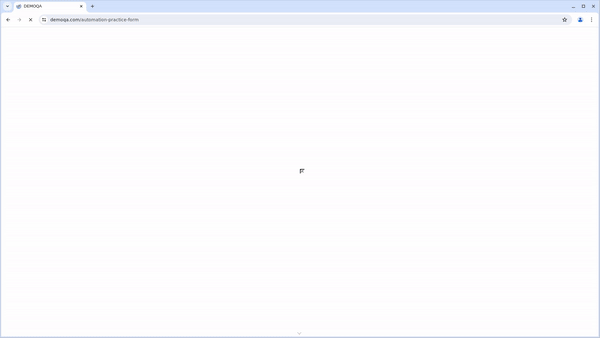

# Проект автоматизации тестирования для сайта [demoqa.com](https://demoqa.com/)  

---


---

## Содержание
* <a href="#о-проекте">О проекте</a>
* <a href="#технологии-и-инструменты">Технологии и инструменты</a>
* <a href="#тест-кейсы">Тест-кейсы</a>
* <a href="#запуск-тестов-в-jenkins">Запуск тестов в Jenkins</a>
* <a href="#отчет-о-выполнении-тестов-в-allure-report">Отчет о выполнении тестов в Allure Report</a>
* <a href="#уведомление-о-результатах-тестов-в-telegram">Уведомление о результатах тестов в Telegram</a>
* <a href="#видео-прохождения-тестов-в-selenoid">Видео прохождения тестов в Selenoid</a>

---
## <a id="о-проекте"></a>О проекте

Данный проект представляет собой автоматизацию тестирования для сайта [demoqa.com](https://demoqa.com/). В тестах проверяются различные сценарии заполнения [формы регистрации](https://demoqa.com/automation-practice-form), включая полное и частичное заполнение полей, а также отображение подсказок для обязательных полей.

Проект реализован с использованием **[PageObject](https://martinfowler.com/bliki/PageObject.html)** для структурирования кода и облегчения его поддержки, а также включает **генерацию тестовых данных** для повышения гибкости и точности проверок.

Основные технологии и инструменты, применяемые в проекте, включают **[Java](https://www.java.com/)**, **[Gradle](https://gradle.org/)**, **[Selenide](https://selenide.org/)** для автоматизации взаимодействия с веб-страницей, а также **[Selenoid](https://aerokube.com/selenoid/)** для запуска тестов в разных браузерах и **[Allure Report](https://github.com/allure-framework/allure2)** для отчетов о прохождении тестов. **[JUnit 5](https://junit.org/junit5/)** используется для организации и выполнения тестов, **[Jenkins](https://www.jenkins.io/)** применяется для CI/CD, а **Telegram бот** уведомляет о результатах тестов.




---

## <a id="технологии-и-инструменты"></a>Технологии и инструменты
<p align="center">
  <a href="https://www.java.com/"></a>
  <a href="https://www.jetbrains.com/idea/"></a>
  <a href="https://github.com/"></a>
  <a href="https://junit.org/junit5/"></a>
  <a href="https://rest-assured.io/"></a>
  <a href="https://gradle.org/"></a>
  <a href="https://selenide.org/"></a>
  <a href="https://aerokube.com/selenoid/"></a>
  <a href="https://qameta.io/"></a>
  <a href="https://github.com/allure-framework"></a>
  <a href="https://www.jenkins.io/"></a>
  <a href="https://www.atlassian.com/software/jira"></a>
  <a href="https://web.telegram.org/"></a>
</p>

---

## <a id="тест-кейсы"></a>Тест-кейсы

Этот раздел включает в себя подробное описание тестов, которые были реализованы для проверки различных аспектов функциональности сайта [demoqa.com](https://demoqa.com/). Тесты делятся на два типа: **UI** (пользовательский интерфейс) и **API** (интерфейс программирования приложений).

- **UI тесты** проверяют взаимодействие пользователя с интерфейсом сайта, включая аутентификацию, заполнение форм и работу с профилем.
- **API тесты** проверяют взаимодействие с сервером, включая авторизацию, создание и удаление пользователей и получение информации о профиле.

Тесты помогают удостовериться в корректной работе функционала сайта, выявить возможные ошибки и улучшить качество приложения.

---

<details>
  <summary><strong style="color:#2a9d8f;">🌐 UI Тесты</strong></summary>

**UI тесты** проверяют функциональность сайта с точки зрения пользователя. Основное внимание уделяется заполнению форм, аутентификации и отображению информации на сайте.

#### 1. **Login**
- **Проверка успешной аутентификации** зарегистрированного пользователя.
- **Проверка неудачной аутентификации** с неверными данными (случайные имя пользователя и пароль).
- **Проверка подсветки обязательных полей**, если они не заполнены.

#### 2. **Profile**
- **Удаление книги** из профиля пользователя через UI.
- **Проверка отображения профиля пользователя** и корректности данных, включая имя пользователя, email и другие атрибуты.

#### 3. **Student Registration Form**
- **Проверка заполнения всех полей формы регистрации**.
- **Проверка заполнения только обязательных полей формы регистрации**.
- **Проверка подсветки обязательных полей**, если они не заполнены.

</details>

<details>
  <summary><strong style="color:#e76f51;">💻 API Тесты</strong></summary>

**API тесты** обеспечивают проверку функциональности серверной части сайта. Это включает в себя проверку успешной авторизации, взаимодействие с данными пользователей через API и выполнение операций, таких как регистрация, удаление пользователей и обновление данных.

#### 1. **Account**
- **Проверка успешной авторизации** через API.
- **Проверка регистрации нового пользователя** через API.
- **Проверка получения данных профиля пользователя** через API.
- **Проверка удаления всех книг** из профиля через API.
- **Проверка удаления пользователя** через API.

</details>

---

### Примечания
- Тесты помогают убедиться в корректной работе всех ключевых функций сайта и ускоряют процесс разработки.
- Для каждой группы тестов используются отдельные методы и фреймворки, чтобы обеспечить точность и стабильность выполнения.


---

## </a> <a id="запуск-тестов-в-jenkins"></a>Запуск тестов в [Jenkins](https://jenkins.autotests.cloud/job/shiian_demoQA_tests/build?delay=0sec)

В данном проекте Jenkins управляет запуском тестов, предоставляет возможность интеграции с различными браузерами и версиями через параметризированные сборки, а также генерирует отчеты о результатах тестирования.



### Параметаризированная сборка позволяет протестировать различные варианты:  
* `browserSize` - Разрешение экрана(по умолчанию стандартное разрешение 1920x1080)  
* `browserName` - Браузер (по умолчанию Chrome)  
* `browserVersion` - Версия браузера (по умолчанию 125,0)  

Jenkins также автоматически интегрируется с Allure Report для создания отчетов и с Telegram для уведомлений о результатах тестов.

### Команды для запуска из терминала

***Локальный запуск:***
```bash  
gradle clean demoqa_test
```

***Удалённый запуск через Jenkins:***
```bash  
clean
demoqa_test
-DremoteDriverURL=https://user1:1234@${remoteDriverURL}/wd/hub
-Dbrowser=${browserName}
-DbrowserVersion=${browserVersion}
-DbrowserSize=${browserSize}
-DvideoHost=${videoHost}
```

---

## </a> <a id="отчет-о-выполнении-тестов-в-allure-report"></a>Отчет о выполнении тестов в [Allure Report](https://jenkins.autotests.cloud/job/EvgenShiy-DemoQA/9/allure/)

Allure Report — это инструмент для создания подробных и наглядных отчетов о результатах выполнения тестов. В нем отображаются все тестовые шаги, статусы тестов, а также дополнительные детали, такие как время выполнения и возможные ошибки. Allure помогает быстро анализировать результаты тестирования и предоставляет информацию в удобном визуальном формате.

Пример отчета для тестового прогона:



Отчет в Allure включает шаги выполнения тестов, их статус и возможные ошибки, помогая легче отслеживать качество тестируемого приложения.
Шаги выполнения на примере Тест-кейса №2 "Проверка заполнения всех полей формы регистрации":

   

---

## </a> <a id="уведомление-о-результатах-тестов-в-telegram"></a>Уведомление о результатах тестов в Telegram

После завершения тестов бот Telegram автоматически отправляет уведомления с результатами тестового прогона, включая информацию о количестве пройденных и неудавшихся тестов.

<p align="center">

</p>


---

## </a> <a id="видео-прохождения-тестов-в-selenoid"></a>Видео прохождения тестов в Selenoid

Видео прохождения Tест-кейса "Проверка заполнения всех полей формы регистрации":

<p align="center">
   
</p>
